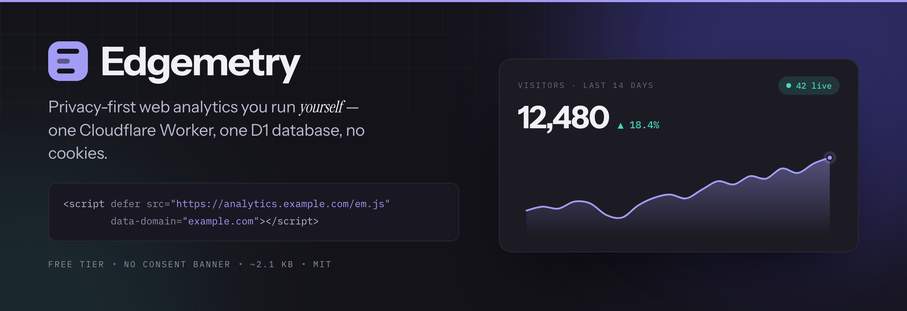

<p align="center">
  
</p>

<p align="center">
  <a href="https://github.com/hayaran/Edgemetry/actions/workflows/ci.yml"></a>
  <a href="https://github.com/hayaran/Edgemetry/releases"></a>
  <a href="LICENSE"></a>
  <a href="https://workers.cloudflare.com/"></a>
  
  
  <a href="https://hayaran.github.io/Edgemetry/"></a>
</p>

# Edgemetry

Privacy-first web analytics you run yourself, on your own domain, on Cloudflare's
free tier. One Worker, one D1 database, no cookies, no consent banner.

Built for the case where Google Analytics is overkill, Plausible Cloud is a
recurring bill, and a VPS running Docker is more infrastructure than a personal
site deserves.

**[Try the demo →](https://hayaran.github.io/Edgemetry/)** — the real
dashboard, running on made-up traffic. No sign-in, nothing to install. Click a
row and watch every panel narrow.

[](https://deploy.workers.cloudflare.com/?url=https://github.com/hayaran/Edgemetry)


## What you get

- **Five metrics** — visitors, pageviews, views per visit, bounce rate and average
  time — each with a sparkline and a previous-period comparison
- **Stackable filters**: click any row and *every* panel narrows at once. Pages in
  Germany, referrers on mobile, whatever combination you want
- **Breakdowns** by page, entry page, exit page, referrer, country, browser, OS,
  device, screen size and UTM tags
- **A real choropleth**, projected and served from your own Worker — no CDN call
- **Realtime**: a live counter, the last thirty minutes minute by minute, and a
  feed of the pages being read right now
- **Custom events** via a one-line `edgemetry('signup')` call
- **A command palette** (`⌘K`) that searches every dimension at once and returns
  filters rather than links
- **Light and dark**, and a dashboard that works down to a phone
- **Multiple sites and multiple users** on one deployment, with per-site access
- **Unlimited history** — daily rollups are never deleted
- **No cookies, no fingerprinting, no personal data at rest**
- **No third-party requests from any browser** — not on your site, not in the
  dashboard. The fonts and the world map ship inside the Worker. The only call
  this project ever makes to anyone is a nightly release check from the Worker
  itself, so it can tell you when you are behind, and
  [`UPDATE_CHECK: "off"`](#configuration) stops even that
- **~2.1 KB tracking script**, served from your own domain

## Getting started

### 1. Deploy

Click the button. Cloudflare will sign you in, copy this repository into your own
GitHub or GitLab account, **create the D1 database automatically**, and deploy
the Worker. There is no API token to generate and nothing to paste.

### 2. Give it a hostname

A freshly created Worker has no route enabled — the dashboard shows **No URLs
enabled**, and there is nothing to open yet. This step is on you, and the choice
you make here is the one worth getting right, because the hostname ends up baked
into the `<head>` of every site you track.

In the Cloudflare dashboard: your Worker → **Settings** → **Domains & Routes** →
**Add custom domain**. Something like `analytics.example.com` is conventional,
and Cloudflare creates the proxied DNS record for you.

Use a domain you own rather than the `*.workers.dev` URL. `workers.dev` is a
shared hostname that ad blockers and corporate DNS filters routinely block
wholesale, which costs you pageviews silently, and WAF rate limiting rules cannot
attach to it at all — it is Cloudflare's zone, not yours. That makes
[the login rate limit](POST-DEPLOY.md#1-rate-limit-the-login-endpoint) impossible
until you have your own. If you enable `workers.dev` anyway for a ten-minute
look, turn it back off afterwards —
[POST-DEPLOY.md](POST-DEPLOY.md#first-confirm-what-getting-started-already-did)
explains why an extra live hostname undoes the protections on the real one.

### 3. Claim the instance

Open your new hostname. The first visit shows a short setup form: your email, a
password, and the domain you want to track. That is the entire configuration step
— the database schema creates itself on first request.

**Do this before the URL exists anywhere but your address bar.** Until the first
account exists, `/setup` is open to whoever reaches it, and that account becomes
the permanent owner. Until you have claimed it, treat the URL as a secret.

### 4. Add the snippet

The dashboard takes over from here: it shows the exact snippet for your instance
under **Settings**, already filled in with your hostname and domain. Copy
it into your site's `<head>`.

```html
<script defer src="https://analytics.example.com/em.js" data-domain="example.com"></script>
```

The Overview page waits for the first pageview and fills itself in — no refresh
needed.

### Deploying from a terminal instead

```bash
npm install && npx wrangler deploy
```

Wrangler provisions the D1 database on first deploy, the same as the button does.
Unlike the button, it also enables the `*.workers.dev` URL, so you get a
reachable hostname immediately — which means step 3 becomes urgent rather than
merely important. Claim the instance, then add your own domain and turn
`workers.dev` off.

## Before you rely on it

A deployed Worker is not yet a safe one. Three things in particular are on you,
not on the deploy button: claiming the instance, keeping it on a hostname you
control with `*.workers.dev` switched off, and putting a rate limit in front of
`/login`, which has no throttle of its own.

**→ [POST-DEPLOY.md](POST-DEPLOY.md)** is the checklist, with each step marked
required, recommended or optional. It also covers what to do when you lose the
only owner password, since there is no reset flow.

## Sites and team access

One deployment serves as many sites as you like. Add them from the site switcher
in the top left of the dashboard; each gets its own snippet, and traffic is fully isolated —
the same visitor even hashes differently per site, so cross-site tracking is
impossible by construction. Site count costs nothing; only total traffic counts
against the free tier.

There are two roles:

| Role | Can do |
|---|---|
| **Owner** | Everything: manage sites, manage users, see every site |
| **Viewer** | Read-only, and only for the sites explicitly granted to them |

Viewers exist so you can hand a client a login to their own dashboard without
exposing your other properties. Under **Team**, an owner can add a user, tick
which sites they see, change a role, reset a password, or remove them.

Permissions are enforced on the server, not by hiding buttons: a viewer
requesting a site they were not granted gets a 403 regardless of what they send.
Changing a password or revoking access invalidates that user's existing sessions
on their very next request, so removing a client is immediate rather than
whenever their cookie happens to expire.

Two guardrails prevent lockout: you cannot remove or demote your own account, and
the last remaining owner cannot be removed or demoted.

## How it stays free

The design is shaped almost entirely by two D1 free-tier limits: **100,000 rows
written per day**, where `DELETE` costs the same as `INSERT` and every secondary
index adds another write per row.

The obvious design — one `events` table with indexes and a nightly `DELETE` —
costs roughly **four row-writes per pageview**, which exhausts the free tier at
around 8,000 visits a day. So instead:

- Raw events go into a **per-hour table with no primary key and no indexes**, so
  one pageview costs exactly **one** row written.
- Those tables are **never deleted from**. They are rolled up and then `DROP`ped.
  `DROP TABLE` is DDL and costs no row writes at all, so expiry is free.
- Rollup tables are `WITHOUT ROWID`, so the primary key *is* the table and a
  rollup row costs one write instead of two.

That works out to roughly **1.2 row-writes per pageview end to end**.

### What filtering costs

Per-dimension rollups cannot answer "pages, but only in Germany" — summing the
`path` rows and the `country` rows separately has already thrown the combination
away. So there is one more table, `stats_cube`, holding one row per distinct
*combination* of dimensions per day.

The important property is that its cost scales with how **varied** your traffic
is, not how much of it there is. A site serving the same 40 routes to the same 30
countries writes the same handful of cube rows whether it gets a thousand
pageviews a day or a million. A site with a unique path per visitor writes one
row per pageview.

For a typical content site that lands somewhere around **+0.3 to +0.6 row-writes
per pageview**. If your traffic is unusually diverse and you would rather have the
budget than the filters, set `FILTERS` to `off` in `wrangler.jsonc`; everything
else keeps working and the filter chips simply return nothing.

Visits, bounce rate and time on site are free: they are computed from the raw
rows at rollup time and stored as extra **columns** on rows that were being
written anyway.

### What reading costs

Writes are the limit people plan for; on a dashboard, **reads are the one that
actually bites**. D1 allows 5,000,000 row reads a day, and the rollup tables are
keyed `(site_id, day, dim, val)` — so a query for one dimension still reads
*every* dimension's rows in the day range and discards the rest. A 30-day range
on a busy site is a couple of thousand rows per query, and it is the number of
queries that decides whether that matters.

So the read path is built around asking as few times as possible:

- **One scan answers every panel.** `/api/breakdown?dim=path,referrer,country,…`
  reads the range once and groups by `(dim, val)`, instead of once per panel.
- **Totals are summed from the series** rather than fetched again. Every
  bucketing folds the same days, so the headline numbers are free once the chart
  has its data.
- **Realtime is one scan, not three.** The raw tables carry no index — that is
  what keeps a pageview at one row written — so every poll is a scan of the
  current hour. Counting online visitors, the per-minute shape and the feed all
  want the same few hundred rows, so they are fetched once and folded in the
  Worker.
- **Only the realtime panel polls, every 30 seconds, and only while the tab is
  visible.** A dashboard left open on a second monitor should not spend the
  day's read budget on a number nobody is looking at.

Together that is roughly **18 scans per dashboard load down to 6**, and an idle
open tab from ~7 million row reads a day to under 100,000.

Filtered views are the expensive case that remains: the cube has to be asked
once per dimension, because a filter's column sits past the key prefix and no
single grouping answers several dimensions at once. If you live in filtered
views on a high-traffic site and start bumping the read limit, an index on
`stats_cube (site_id, day, country)` — or whichever dimension you actually
filter by — trades about one extra row written per cube row for a much cheaper
read.

| Resource | Free limit | At 10k visits/day |
|---|---|---|
| Worker requests | 100,000/day | ~40,000 |
| D1 rows written | 100,000/day | ~50,000 |
| D1 rows read | 5,000,000/day | well under |
| D1 storage | 5 GB | years of rollups |

**The free tier comfortably covers roughly 20,000 visits a day.** Past that,
Workers Paid is $5/month and raises every limit by orders of magnitude — the
architecture does not change, you just switch plans.

### Where the numbers come from

| Question | Source |
|---|---|
| Unfiltered, finished days | `stats_daily` — kept forever |
| Unfiltered, today | `stats_hourly`, refreshed at :05 each hour, plus the live raw hour |
| Filtered, finished days | `stats_cube` |
| Filtered, today | Today's raw hour tables, read directly |

Two cron triggers do the folding, and the dashboard repairs any hour the cron
missed on the next page load, so a failed or delayed run is self-healing.

A **visit** is one visitor's pageviews inside a UTC day. With no session id
stored that is the most this can honestly claim, and it has the tidy consequence
that visits and daily unique visitors are the same number. Views per visit,
bounce rate and average time are all ratios over it.

### The graph API

The dashboard is a client of four public endpoints; nothing it can show is
unavailable to a script. All of them take `site`, `range`
(`today`/`7d`/`30d`/`90d`/`12mo`, or explicit `from`/`to`), `cmp=1` for a
previous-period comparison, and `f` for the filter stack.

```
GET /api/summary    ?range=30d&cmp=1     → totals, previous, and a per-metric series
GET /api/timeseries ?metric=visitors     → [{ label, cur, prev }]
GET /api/breakdown  ?dim=path,country    → one ranking per dimension, in one trip
GET /api/realtime                        → { online, minutes: […30], recent: […] }
```

Filters are `f=dim:value` pairs, comma separated, values percent-encoded.
Several values of one dimension mean *either*; two dimensions mean *both*:

```
/api/breakdown?dim=path&range=30d&f=country:DE,country:FR,device:Mobile
```

Filterable dimensions are `path`, `referrer`, `country`, `browser`, `os`,
`device`, `screen` and the three `utm_*` tags. Rankings can also be asked for
`entry`, `exit` and `event`.

## Privacy and GDPR

There is no cookie, no `localStorage`, and no persistent identifier. A visitor is
counted as:

```
sha256(daily_salt + site_id + ip_address + user_agent)
```

- The **salt is random per UTC day** and deleted two days later. Once it is gone,
  that day's hashes cannot be recomputed or correlated with any other day —
  the same approach Plausible uses.
- The **raw IP address is never stored**. It exists only in memory long enough to
  compute the hash.
- **Raw event rows are dropped within 24–48 hours.** After that only aggregate
  counts remain, with no visitor identifiers at all.
- Only the referrer's **hostname** is kept, never the full referring URL, which
  routinely carries search terms and session tokens.

Because there is no cookie and no personal data stored, this does not require a
consent banner under GDPR or ePrivacy. And since you deploy to your own
Cloudflare account on your own domain, there is no third-party processor to
disclose. **This is not legal advice** — if you operate under strict
interpretation, check with your own counsel.

## Configuration

Set in `wrangler.jsonc` under `vars`:

| Variable | Default | Notes |
|---|---|---|
| `HOURLY_RETENTION_DAYS` | `7` | How long hour-resolution data is kept. Daily rollups are kept forever regardless. |
| `FILTERS` | `on` | Writes `stats_cube`, which is what makes the filter chips work. Set to `off` to trade filtering for a smaller write budget — see [What filtering costs](#what-filtering-costs). |
| `PBKDF2_ITERATIONS` | `15000` | **A CPU budget concession, not a secure default.** OWASP's figure for PBKDF2-HMAC-SHA256 is 600,000; this is 15,000 because the Workers **free** plan allows 10 ms of CPU per request. The edge rate limit is what compensates. Raising it has a sharp edge — see [POST-DEPLOY.md](POST-DEPLOY.md#10-tune-the-configuration-vars). |
| `UPDATE_CHECK` | `on` | Once a day the nightly cron asks GitHub for the newest Edgemetry release, so the account menu can say whether you are behind — see [Updating a deployment](#updating-a-deployment). Set to `off` to make no such request. |

That is the whole list, and none of it is required — the defaults are the intended
configuration. One setting deliberately sits outside this table: **Script URL**,
under **Settings** in the dashboard, which overrides the `src` in the
install snippet. It is not a `var` because its value does not exist until after
the first deploy — it depends on the hostname you landed on, whether you renamed
the tracker file, and whether you later split the dashboard onto its own hostname
behind Access. Empty means "this origin, serving `/em.js`", which is correct for
every instance that has not done one of those things.

## Testing it

### Run it locally

```bash
npm install
npm run dev
```

Open http://localhost:8787, complete the setup form, and use `example.com` as the
domain if you want the seed script below to work unchanged.

### Generate traffic

```bash
npm run seed
```

Posts 150 synthetic pageviews and custom events through the real tracker
endpoint, with varied browsers, devices, referrers, countries and UTM tags — so
it exercises the whole pipeline, not just the database. Point it anywhere:

```bash
npm run seed -- --url https://stats.example.com --domain example.com --events 500
```

Everything above lands in the current hour, because timestamps are set
server-side and there is no way to backdate a beacon. To fill a dashboard with
something worth looking at — a trend, a comparison, weekday shape — write the
history directly instead:

```bash
npm run seed -- --days 45 --domain example.com
npx wrangler d1 execute edgemetry --local --file .seed.sql
curl "http://localhost:8787/cdn-cgi/handler/scheduled?cron=20+0+*+*+*"
```

The last line folds every finished day into the rollups and the filter cube, so
what you end up with is exactly what real traffic would have produced.

### Test from a real browser

`scripts/demo-page.html` is a page with the snippet already installed. Serve it
over http (the tracker ignores `file://` pages):

```bash
npx serve scripts
```

Open it and click the buttons. The navigation buttons use `history.pushState`,
so they also verify single-page-app tracking; the others fire custom events.
Watch the **Last hour** counter on the dashboard.

Note the `data-local="true"` attribute on that page. By default the tracker
ignores localhost so your development traffic never pollutes real stats — that
attribute is the opt-in, and you remove it on a real site.

### Automated tests

```bash
npm test        # inside the real Workers runtime, against a real D1
npm run typecheck
```

### Regenerating the bundled assets

The dashboard's typefaces and its world map are generated files, checked in so
that a clone builds without network access; the images at the top of this file
are made the same way, out of the mark and the palette the console already uses.
Re-run these only if you want to change the projection, the canvas, the fonts or
the banner:

```bash
npm run build:map     # src/world.ts   — Natural Earth 110m, Equal Earth projected
npm run build:fonts   # src/fonts.ts   — Latin subsets of the three typefaces
npm run build:cover   # .github/assets — the banner above, and the social preview
```

### The demo site

[The demo](https://hayaran.github.io/Edgemetry/) is this dashboard with a
fake back end, served from GitHub Pages. There is no Worker behind it and no
database — `scripts/demo-mock.js` patches `fetch` before the console boots and
answers the same six endpoints out of a synthetic corpus it generates in the
browser.

```bash
npm run build:demo    # demo-dist/ — the page, the mock, the map, the fonts
npx serve demo-dist   # or any static server
```

The interesting part is what keeps it honest, because a stale demo is worse than
no demo:

- **The page cannot drift from the console.** `scripts/build-demo.mjs` generates
  it from `src/dashboard.html` — it does not copy it — and CI rebuilds on every
  push to `main`. A UI change ships to the demo in the same commit that makes it.
- **The data cannot go stale.** No dates are baked in. Events are generated at
  offsets from whenever you open the page, so the demo is always the last six
  months ending today, with a realtime panel that moves. The seed is fixed, so
  everyone looking at it on the same day sees the same numbers.
- **The API shape cannot drift silently.** `test/demo.test.ts` runs the real
  Worker and the mock side by side and compares the structure of every response.
  Add a field to `/api/summary` without teaching the mock about it and the build
  goes red — which is how `trackerUrl` was caught the first time.

Everything is computed per request rather than served from fixtures, so filters
stack, ranges re-bucket, comparison works and `⌘K` searches — the demo behaves
like the product because it *is* the product, only lying about the numbers.

### Testing the rollups

Cron triggers do not fire under `wrangler dev`, so trigger them by hand:

```bash
curl "http://localhost:8787/cdn-cgi/handler/scheduled?cron=5+*+*+*+*"    # hourly
curl "http://localhost:8787/cdn-cgi/handler/scheduled?cron=20+0+*+*+*"   # daily
```

Both only process *completed* hours and *finished* days, so immediately after
seeding they will correctly do nothing — all of your data is still in the live
hour. To give them something to chew on, copy the current hour's raw table into a
past hour and run the hourly job:

```bash
npx wrangler d1 execute edgemetry --local \
  --command "CREATE TABLE ev_2026072809 AS SELECT * FROM ev_2026072810"
```

Then inspect what came out:

```bash
npx wrangler d1 execute edgemetry --local \
  --command "SELECT dim, COUNT(*) AS n, SUM(pageviews) AS pv FROM stats_hourly GROUP BY dim"
```

## Updating a deployment

**Deploys never touch your data.** A deploy replaces the Worker code; the D1
database and everything in it is a separate resource that is left alone.

### Your own instance

If you deployed with the button, Cloudflare connected CI/CD to your repository —
push to the default branch and it redeploys. Otherwise:

```bash
npx wrangler deploy
```

New tables are created automatically on the first request after a deploy, because
the schema is applied with `CREATE TABLE IF NOT EXISTS` on startup. Upgrading
from a pre-user-model version also migrates the old single admin password into a
real owner account, so nobody gets locked out.

Columns added by a later version are applied the same way, with `ALTER TABLE ADD
COLUMN` run once per isolate and "already there" swallowed rather than tested
for. That covers adding a table and adding a column; a change that needs to
*modify* or drop a column would still need explicit migration code keyed off the
`schema_version` value in `settings`.

Upgrading is safe mid-hour: the raw table currently being written to was created
by the previous version, so both the ingest path and the rollup widen it on
demand before they touch it.

### Knowing there is something to take

The deploy button *imports* this repository into your account rather than forking
it. Your copy has no parent, which means no **Sync fork** button, no "N commits
behind" banner, and a compare view GitHub will refuse — two repositories with no
shared history have nothing to compare. Left alone, an instance would sit on old
code with nothing anywhere saying so.

So the instance tells you. Once a day, beside the nightly rollup, the Worker asks
GitHub for the newest release and stores the answer; if it is ahead of you, the
account menu carries a line saying how far:

> **Update available** — 2 releases behind

It links to the release notes, which are what you actually want before deciding.
The check is the only request this project makes to anyone, it runs on a cron
rather than in a browser, and it says nothing about your instance beyond the
version it is asking about. `UPDATE_CHECK: "off"` in `wrangler.jsonc` stops it.
Owners see the line; viewers do not, since they cannot act on it. The version you
are running is in that menu either way, next to your role.

### Taking the update

**Actions → Update Edgemetry → Run workflow**, in your own copy of the
repository. It fetches upstream, composes the new version as a single ordinary
commit, and opens a pull request. Merging is what deploys — CI runs on the pull
request first, so you can see it type-checks and passes its tests before you do.

Nothing about that is automatic. The workflow has no trigger but the button
unless you set the repository variable `AUTO_UPDATE_PR` to `on` (Settings →
Secrets and variables → Actions → Variables), and even then it only opens the
pull request; the deploy still waits for you to merge it.

The commit it composes replaces every tracked file with upstream's copy — that is
what lets it apply to an imported repository with no conflicts at all. Your data
and your configuration are somewhere else entirely (D1 and Cloudflare
respectively) and are untouched, but if you have *edited* files in your copy, the
diff is where you will see them go. Read it before merging.

From a terminal, the same thing by hand:

```bash
git remote add upstream https://github.com/hayaran/Edgemetry.git
```

```bash
git fetch upstream main && git switch -c update && git reset --hard upstream/main && git reset --soft main && git commit -m "Update Edgemetry"
```

### One footgun worth knowing

On your first `wrangler deploy`, Wrangler writes the new `database_id` back into
`wrangler.jsonc`. Do not commit that line to a public fork — see
[POST-DEPLOY.md](POST-DEPLOY.md#4-keep-database_id-out-of-a-public-fork).

## Known limitations

Being upfront about these:

- **A GitHub or GitLab account is required for the deploy button**, because it
  copies the repository into your account to wire up CI/CD. The terminal route
  (`npx wrangler deploy`) does not need one.
- **Updates are something you take, not something you get.** Nothing redeploys on
  its own: the account menu tells you when a release is out and a workflow opens
  the pull request, but merging it is yours to do — see
  [Updating a deployment](#updating-a-deployment).
- **Unique visitors over multi-day ranges are summed daily totals**, so a person
  visiting on Monday and Tuesday counts twice. This is unavoidable given a salt
  that rotates daily, and it is exactly what Plausible and GoatCounter do. Single
  day totals are exact.
- **Per-dimension visitor counts are an upper bound** for the same reason.
  Pageview counts are always exact.
- **All bucketing is UTC.** There is no per-user timezone setting yet.
- **Filtering by a path narrows to the visits that *started* there.** The cube
  records where each visit began, not every page it passed through, so
  "visitors" under a `path` filter means entrances. Pageviews under that filter
  are exact, and the dashboard says which basis it is using. Filtering by
  anything visit-stable — country, browser, device, referrer, UTM — is exact.
- **Time on site excludes the last page of a visit**, because there is no unload
  beacon to measure it with. A single-page visit therefore counts as zero
  seconds. Every tool without an unload beacon has this floor; it is stated here
  rather than papered over.
- **Screen size is bucketed into four ranges** and the exact width is never
  stored — it is too good a fingerprinting signal to keep for a chart.
- **D1 caps a compound `SELECT` at five terms**, and a day is 24 raw hour tables.
  Wide unions are nested into a tree of five-term compounds to get around it,
  which is worth knowing before you edit any query that spans a whole day.
- Ad blockers that block *all* beacon-shaped requests heuristically will still
  catch some traffic. First-party hosting plus a custom path defeats the common
  hostname and path rules, not every possible heuristic.
- **Login attempts are not throttled by the Worker.** No lockout, no backoff, no
  429 — ten failed passwords take about as long as one, and the password hash is
  intentionally cheap on top of that. Mitigating it is the operator's job and it
  belongs at the edge, which also means it cannot be done at all while the Worker
  is on `*.workers.dev`. See [POST-DEPLOY.md](POST-DEPLOY.md#1-rate-limit-the-login-endpoint).
- **The ingest endpoint is public**, as it must be. Someone who finds it could
  send junk events and burn through your daily quota — the same exposure every
  analytics tool has. Known bots are dropped before any write, but if you expect
  trouble, a Cloudflare rate-limiting rule on the endpoint path is the answer.
  Note that the free plan's single rule is better spent on `/login`: a quota
  someone burned is an annoyance, an account someone guessed is not.

## Roadmap

- Real sessions, so a visit can cross midnight and time on site can include the
  last page of one
- Public/shareable dashboards
- Per-site timezone
- CSV export
- Cloudflare Email Routing, for invite links, password resets and scheduled
  reports

## Prior art

[Counterscale](https://github.com/benvinegar/counterscale) established this
category and is well worth your consideration. The main differences here are
storage and setup: Counterscale uses Workers Analytics Engine, which caps
retention at 90 days and needs an API token pasted in at install time.
Edgemetry uses D1, which keeps history indefinitely and needs no token,
which is what makes true one-click deployment possible.

## Author

Built by Nitin Hayaran — [@nitinhayaran](https://x.com/nitinhayaran) on X, where
I post about what goes into this.

## License

MIT — see [LICENSE](LICENSE).
